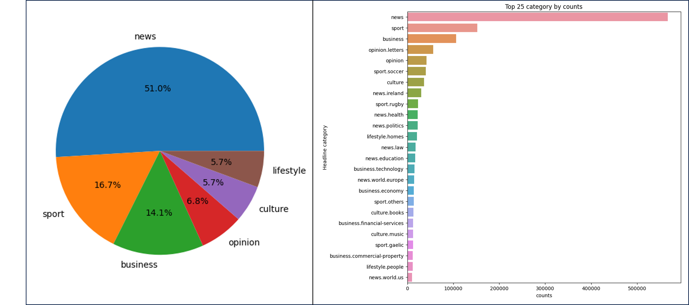
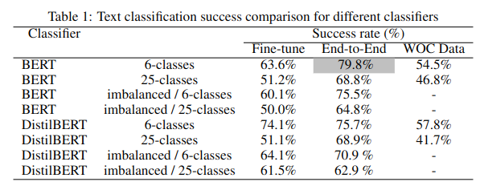
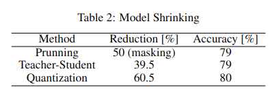

# nlp-project-irish-times-dataset

The project focuses on analyzing and processing the "Irish Times" dataset, which consists of 1.6 million headlines from articles on The Irish Times news website. The goal is to classify the type of headline by reading it.

In Part A of the project, we conducted an initial analysis of the "Irish Times" dataset, which involved performing text analysis and employing various visualization techniques. The text analysis provided insights into the structure and content of the headlines, while the visualizations helped us understand the distribution of headline types and word frequencies. Additionally, we performed data cleaning operations to remove punctuation, stop words, and irrelevant elements, ensuring a clean and meaningful dataset for the classification task. This analysis and data preparation laid a strong foundation for subsequent stages of the project, enabling us to proceed in the classification task.

In Part B of the project is the main focus and involves implementing training of trained models. Two models, BERT and DistilBERT, are utilized, and their results are compared. 

Additionally, the BERT model is shrunk using three different approaches: pruning, distillation, and quantization. The outcomes of these shrinking methods are evaluated and compared.

The models used in the project are sourced from the Hugging Face library and implemented using PyTorch. 
